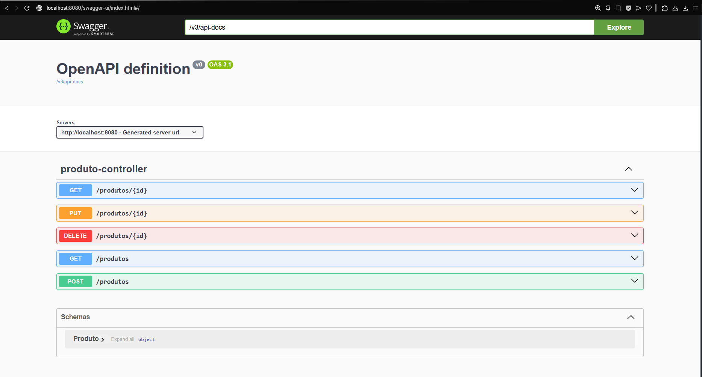

# 📦 ProdutosAPI

**ProdutosAPI** é uma aplicação backend desenvolvida com **Spring Boot**, que expõe uma API RESTful para gerenciamento de produtos. A aplicação permite realizar operações de cadastro, consulta, atualização e exclusão de produtos, utilizando **JPA** para persistência dos dados em um banco de dados H2 em memória.

A aplicação está preparada para funcionar também com **PostgreSQL**, bastando configurar o `application.yml` com os dados do banco desejado.

---

## 🚀 Tecnologias utilizadas

- Java 21
- Spring Boot
- Spring Data JPA
- Banco de dados H2 (em memória)
- PostgreSQL (opcional)
- Maven

---

## 📌 Funcionalidades

- ✅ Cadastro de produtos com ID gerado automaticamente (UUID)
- 🔍 Consulta de produto por ID
- 🔍 Consulta de produtos por nome
- ✏️ Atualização de dados de um produto existente
- ❌ Remoção de produto por ID
- 🧪 Acesso ao console do banco H2 para testes e visualização dos dados (`/h2-console`)

---

## 🔐 Sobre o campo `ID`

Na criação de novos produtos via `POST`, **não é necessário informar o campo `id`** no JSON.  
O sistema gera automaticamente um identificador único (UUID) para cada produto.

Essa configuração foi feita usando:

```java
@JsonProperty(access = JsonProperty.Access.READ_ONLY)
````
---

## 📖 Documentação da API (Swagger)

A documentação dos endpoints está disponível via Swagger UI:

🔗 [Acesse o Swagger aqui](http://localhost:8080/swagger-ui.html)

### 🖼️ Interface Swagger



---

## 🛠️ Estrutura da tabela SQL

```sql
CREATE TABLE produto (
    codigo VARCHAR(255) NOT NULL PRIMARY KEY,
    nome VARCHAR(50) NOT NULL,
    descricao VARCHAR(300),
    preco NUMERIC(18, 2)
);
